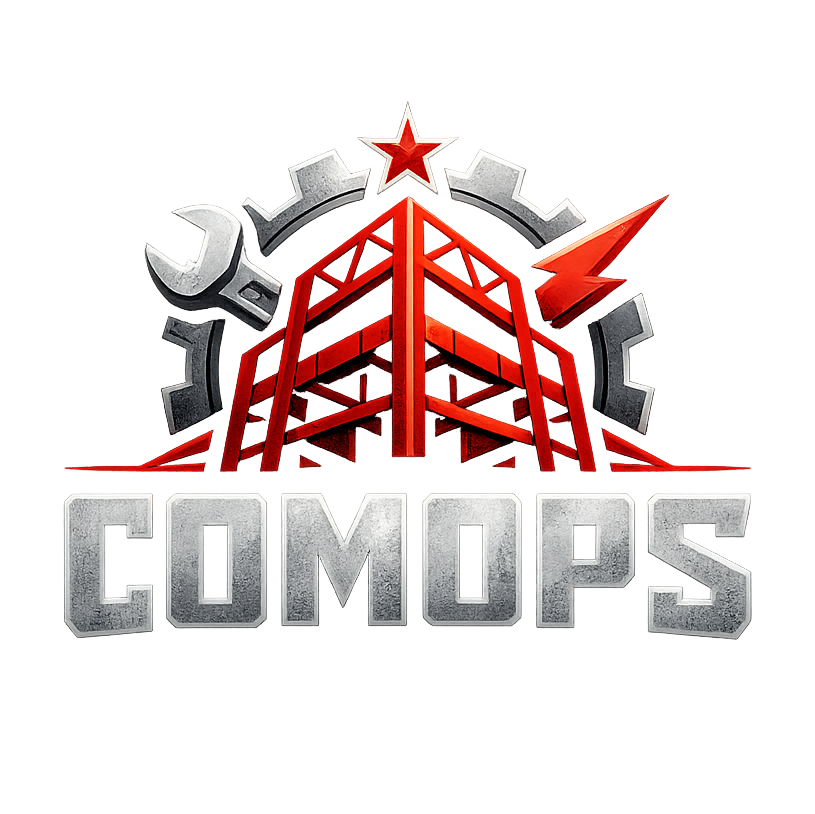

# COMOPS



**COMOPS** significa **COnstruction Management OPerationS**: una aplicación full-stack autohospedada para llevar una reforma real como una operación viva, no como una carpeta de documentos dispersos.

El foco del sistema es la **tarea**: cada llamada, presupuesto, incidencia, intervención, factura o documento debe poder aterrizar en trabajo accionable, con contexto, responsable, fechas, riesgo y trazabilidad.

## Qué Resuelve

COMOPS centraliza la operación diaria de una reforma:

- planificación por tareas, épicas, hitos y Gantt;
- seguimiento de incidencias, requisitos, decisiones y bloqueos;
- contactos, gremios, proveedores y comunicaciones;
- solicitudes de presupuesto, presupuestos recibidos y comparaciones;
- facturas, pagos, saldos, vencimientos y economía del proyecto;
- documentos persistentes: presupuestos, facturas, fotos, licencias, boletines, certificados;
- cronología y actividad auditables;
- búsqueda global como launcher para encontrar entidades o saltar a secciones.

## Estado Actual

La aplicación ya está preparada para uso local/productivo monousuario:

- autenticación local obligatoria;
- PostgreSQL persistente;
- API ASP.NET Core con EF Core;
- frontend React/TypeScript/Vite;
- Docker Compose para despliegue completo;
- almacenamiento documental en volumen persistente;
- backups manuales simples de base de datos y documentos;
- UI oscura templada, pensada para uso nocturno sin irse a negro absoluto.

## Módulos

### Tareas

La tarea es el centro operativo de COMOPS.

- Mesa principal con cola priorizada.
- Focos rápidos: abiertas, bloqueadas, vencidas y tareas con datos insuficientes.
- Jerarquía de épicas, tareas e hitos.
- Gantt con trabajo, esperas, hitos y avisos discretos.
- Ficha de tarea con preparación, flujo de estados, contexto directo y relaciones.
- Formulario por bloques: identidad, contexto operativo, planificación, ejecución y riesgos.

### Proyecto

- Datos base del proyecto.
- Presupuesto objetivo, contingencia, estado, ubicación, notas y etiquetas.
- Dashboard económico y operativo.

### Proveedores y Contactos

- Directorio de contactos y gremios.
- Comunicaciones, tareas, visitas, presupuestos e intervenciones vinculadas.
- Fichas con contexto y bitácora.

### Finanzas

- Presupuestos y líneas.
- Comparaciones de ofertas.
- Facturas y pagos.
- Cálculo de saldos, vencimientos y desviación económica.

### Seguimiento

- Alertas.
- Incidencias.
- Requisitos.
- Decisiones.
- Relaciones contextuales y bitácora.

### Documentos

- Subida y descarga de documentos.
- Clasificación por tipo.
- Edición de metadatos.
- Archivo lógico sin borrar físicamente por defecto.

## Arquitectura

```text
COMOPS
├─ frontend/                  React + TypeScript + Vite
│  ├─ src/
│  │  ├─ api/                 cliente HTTP
│  │  ├─ components/          componentes UI comunes
│  │  ├─ styles/              CSS de aplicación
│  │  ├─ domain.ts            tipos y catálogos frontend
│  │  └─ main.tsx             shell y pantallas actuales
│  └─ public/comops-logo.png
├─ backend/
│  ├─ Reforma.Api/            ASP.NET Core minimal API + EF Core
│  └─ Reforma.Tests/          pruebas de reglas y regresión
└─ docker-compose.yml         PostgreSQL + backend + frontend
```

El backend se mantiene en `Reforma.Api` por continuidad histórica del proyecto. El producto publicado es COMOPS.

## Arranque Rápido

```bash
cp .env.example .env
docker compose up -d --build
```

Abrir:

```text
http://localhost:8094
```

Credenciales por defecto si no se cambian antes del primer arranque:

```text
admin@example.local
change-this-password-before-use
```

Para uso real, cambia en `.env`:

```text
COMOPS_ADMIN_EMAIL
COMOPS_ADMIN_PASSWORD
POSTGRES_PASSWORD
```

Las variables legacy `REFORMA_ADMIN_EMAIL` y `REFORMA_ADMIN_PASSWORD` siguen soportadas por compatibilidad.

## Desarrollo Local

Backend:

```bash
docker compose up -d postgres
dotnet run --project backend/Reforma.Api/Reforma.Api.csproj
```

Frontend:

```bash
cd frontend
npm install
npm run dev
```

Build frontend:

```bash
cd frontend
npm run build
```

Tests backend:

```bash
dotnet test backend/Reforma.Tests/Reforma.Tests.csproj
```

Si no hay SDK global en la máquina, se puede ejecutar con contenedor:

```bash
docker run --rm -v "$PWD/backend":/src -w /src mcr.microsoft.com/dotnet/sdk:8.0 dotnet test Reforma.Tests/Reforma.Tests.csproj
```

## Backups

PostgreSQL:

```bash
docker compose exec -T postgres pg_dump -U reforma reforma > backup-reforma.sql
```

Documentos:

```bash
docker run --rm \
  -v reforma-vivienda_reforma-documents:/data:ro \
  -v "$PWD":/backup \
  alpine tar czf /backup/documentos.tgz -C /data .
```

Sumas:

```bash
sha256sum backup-reforma.sql documentos.tgz > SHA256SUMS
sha256sum -c SHA256SUMS
```

## Restauración

```bash
docker compose down
docker compose up -d postgres
cat backup-reforma.sql | docker compose exec -T postgres psql -U reforma reforma
docker run --rm \
  -v reforma-vivienda_reforma-documents:/data \
  -v "$PWD":/backup \
  alpine sh -c 'cd /data && tar xzf /backup/documentos.tgz'
docker compose up -d --build
```

## Seguridad y Datos

- No subas `.env`.
- No subas `docs/` si contiene notas operativas, capturas, QA real o datos de proyectos concretos.
- No subas backups productivos.
- No recrees volúmenes si hay datos reales.
- Antes de migraciones, rebuilds importantes o limpiezas, haz backup de PostgreSQL y documentos.
- La app está pensada como MVP monousuario/autohospedado; no sustituye una política formal de permisos, auditoría externa o copias fuera de máquina.

## Roadmap Natural

- Extraer `TasksPage` y formularios grandes a componentes propios.
- Añadir edición granular de documentos/facturas/presupuestos desde ficha de tarea.
- Mejorar dependencias entre tareas con UI dedicada.
- Añadir import/export operativo.
- Endurecer autenticación y roles si pasa de monousuario.

## Licencia

Repositorio publicado bajo la licencia incluida en `LICENSE`.
